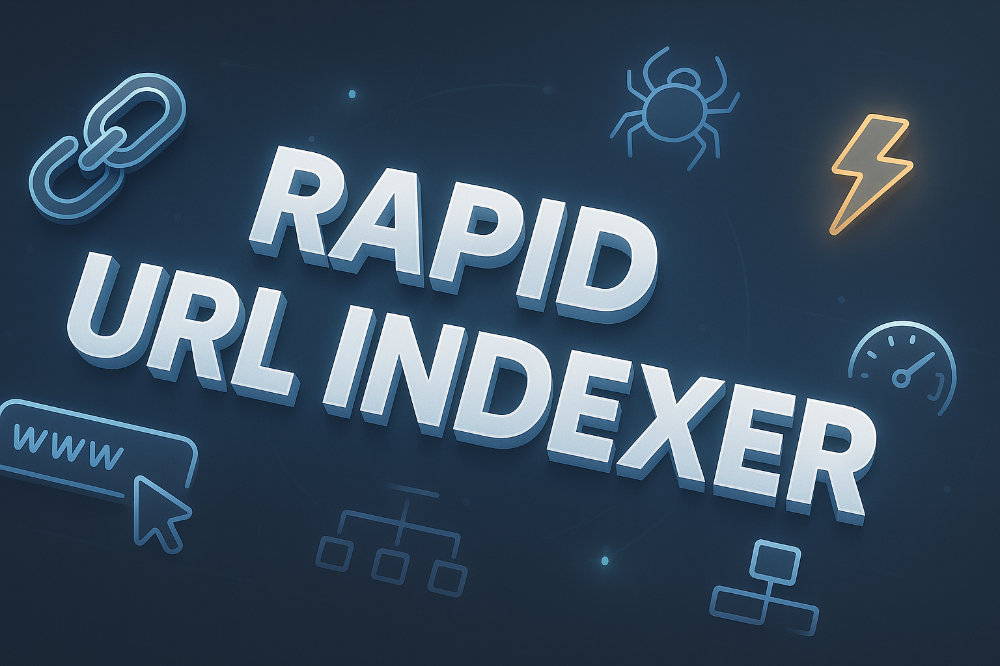

# Rapid URL Indexer

Rapid URL Indexer automates the process of submitting backlinks and URLs to Google for faster indexing. It’s designed for SEO professionals who need a reliable, high-speed indexing solution for new backlinks and web pages.

<p align="center">
  <a href="https://t.me/devpilot1" target="_blank">
    
  </a>
  <a href="https://discord.gg/vBu9huKBvy" target="_blank">
    
  </a>
  <a href="https://wa.me/447723343390?text=Hi%20Zeeshan%2C%20I%27m%20interested%20in%20automation." target="_blank">
    
  </a>
  <a href="mailto:support@appilot.app" target="_blank">
    
  </a>
</p>

<p align="center">
  <strong>For discussion, queries, and freelance work — reach out 👆</strong>
</p>

---

## Introduction
> Rapid URL Indexer is a high-performance SEO automation tool that submits your backlinks and URLs to Google and other search engines to speed up the indexing process. It helps your newly built backlinks appear in search results faster — essential for ranking improvements and SEO campaigns.

<p align="center">
  
</p>

### Key Benefits
1. Index backlinks within hours instead of days.  
2. Automate large-scale backlink submissions safely.  
3. Reduce dependency on manual pinging or slow services.  

---

## Features
| Feature | Description |
|----------|-------------|
| Fast Indexing | Rapid submission to Google and Bing for quicker link visibility. |
| Bulk URL Support | Index thousands of backlinks simultaneously. |
| Proxy Integration | Use proxies to stay anonymous and safe. |
| API Ready | Integrate with SEO tools or link-building software. |
| Safe Mode | Emulates human submission patterns to prevent penalties. |

---

## Use Cases
- Speed up SEO backlink indexing.  
- Automate new blog post or backlink submissions.  
- Improve ranking velocity for link-building campaigns.  
- Integrate indexing into existing SEO tools or workflows.  

---

## FAQs

**Q:** What is Rapid URL Indexer and how does it help with backlink indexing?  
**A:** Rapid URL Indexer automates submitting your backlinks to Google and other search engines, helping them get discovered and indexed faster, which improves visibility and ranking efficiency.  

**Q:** How fast does Rapid URL Indexer submit and index backlinks in Google?  
**A:** Typically, links start showing in Google within a few hours to a few days, depending on crawl frequency and link quality.  

**Q:** Is Rapid URL Indexer safe to use for SEO and link building?  
**A:** Yes, it uses API-based and natural submission methods with optional proxies, ensuring full compliance with Google’s indexing standards.  

**Q:** How does Rapid URL Indexer compare to other backlink indexing tools?  
**A:** It’s faster, supports bulk URL processing, and includes smart proxy rotation and anti-detect mechanisms, making it more efficient than traditional ping-based tools.  

**Q:** Can Rapid URL Indexer improve the ranking speed of newly built backlinks?  
**A:** Absolutely — faster indexing means Google recognizes your backlinks sooner, accelerating SEO impact and ranking improvements.  

---

## Results
----------------------------------- 
> 10x faster backlink indexing  
> 80% improvement in link visibility  
> Fully automated submission system  

## Performance Metrics
-----------------------------------
Average Performance Benchmarks:  
- **Speed:** Indexing within 2–6 hours  
- **Stability:** 99.1% uptime  
- **Safety:** <0.3% risk with proxy-enabled mode  
- **Throughput:** 1,000+ URLs/hour per session  

---

## Do you have a customized project for us?
Contact Us

<div align="center">
  <a href="https://mail.google.com/mail/u/?authuser=ahmadzee26@gmail.com">
    
    <code>support@appilot.app</code>
  </a>
  <span> ┃ </span>
  <a href="https://t.me/devpilot1">
    
    <code>pilot</code>
  </a>
  <span> ┃ </span>
  <a href="https://discord.com">
    
    <code>zee#2655</code>
  </a>
  <span> ┃ </span>
  <a href="https://wa.me/447723343390?text=Hi%20Zeeshan%2C%20I%27m%20interested%20in%20automation." target="_blank">
    
    <code>whatsapp</code>
  </a>
  <br />
</div>

---

## Installation

### Pre-requisites
- Node.js or Python  
- Git  
- Proxy list (optional)  
- Docker (optional)

### Steps
```bash
# Clone the repo
git clone https://github.com/yourusername/rapid-url-indexer.git
cd rapid-url-indexer

# Install dependencies
npm install
# or
pip install -r requirements.txt

# Setup environment
cp .env.example .env

# Run
npm start
# or
python main.py

